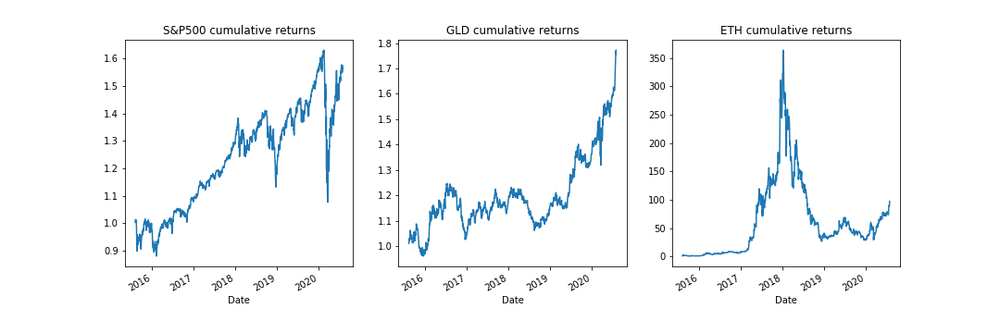
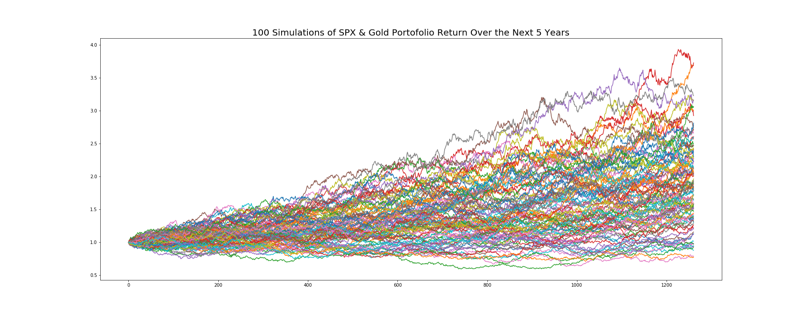
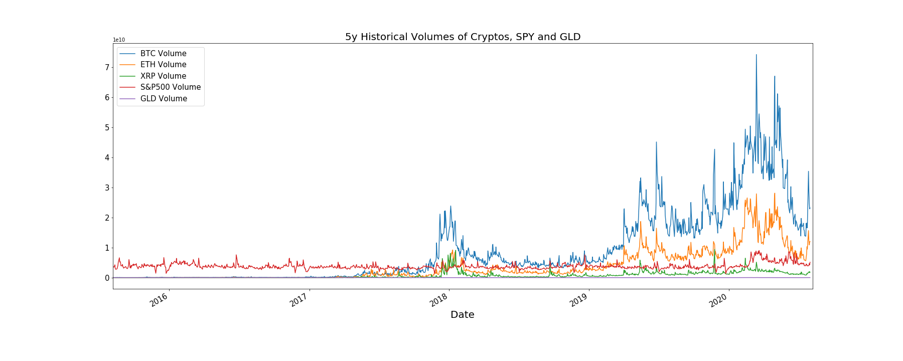

# Team 4 Group Project: Cryptocurrency Growth Against Other Assets in Today's Macroeconomic Environment

## Part I. Cryptocurrency Investment Performance Analysis

In this section, we chose to analyze the top 3 cryptocurrencies by market cap as an investment. With this data in mind, we aimed to answer the following question:

### Are cryptocurrencies performing and growing in popularity in comparison with the traditional equities market?

We used the past 5-years of historical market data of the S&P 500 Index and the Gold ETF(GLD) against our cryptocurrency portfolio, which consists of the top 3 digital currencies: Bitcoin(BTC), Ethereum(ETH) and Ripple(XRP). We compared the following metrics: Risk, Return & Trading Volume.

*All input data is from Google Finance in the data directory*

First, let's take a look at the daily returns of S&P 500, Gold, and the Cryptocurrencies. 

As we can see, the daily returns for Ripple and Ethereum are far more extreme compared to the others. For example, in 2018, Ripple went up by more than 80% daily while S&P500 and Gold are well capped by 20% for the past 5 years. Now, what about the cumulative returns? 

Based on the extreme volatility shown in the previous daily return graph, it is expected that the cumulative returns of Cryptos would not be a steadily upward line, but we can tell they still well outshined the performance of S&P 500 and Gold. The peak, at almost 35000% cumulative return of Ethereum from 2015 to 2018, shows the bubble when Cryptocurrency became an insane fever internationally and then rapidly plunged due to people's fear and doubt in its real intrinsic value. By contrast, market and gold returns seem almost flat because of the massive scale from Cryptos, so it will be helpful to see how much returns that actually has been generated from August 2015 to August 2020 compared to Ethereum: 

Let's the numbers in dollar terms and the investment returns if we start with 5000 USD: 

If invested in Bitcoin, I would end up after 5 years with 119,720 USD;  
If invested in Etherum, I would end up after 5 years with 485,796 USD;  
If invested in Ripple, I would end up after 5 years with  142,216 USD;  
If invested in Gold, I would end up after 5 years with 8,860 USD;  
If invested in S&P 500, I would end up after 5 years with  7,872 USD.

Therefore, we better off investing in cryptos in terms of returns. Moreover, We want to calculate the annual standard deviations and their correlations: 

| Ticker  | Annual Std |
| --------| -----------|
| XRP     |    1.1803  |
| ETH     |    1.0815  |
| BTC     |    0.6730  |
| S&P 500 |    0.1942  |
| GLD     |    0.1345  |

As we can see, Cryptos are about 5 times more volatile than market. S&P 500 & gold has a negative correlation indicating they tend to move in opposite directions. Cryptos are more correlated to each other than to S&P 500 and Gold. Take BTC as an example, it's 14% correlated to S&P 500 and 10% correlated to Gold, indicating that it performs more simlarly to traditional riskier assets even though it is designed to a be a medium of exchange currency. 

It will be worth looking at sharpe ratios as well. 

According to the bar chart, Etherum offers the best risk-adjusted returns among assets of other Cryptos, Gold and S&P 500, assuming zero risk-free interest rate. 

It would be very interesting to know how future return looks like for Crytos, so we ran a Monte Carlo Simulation on two portfolios (100 simulations over the next 5 years): One consists of 80% S&P and 20% Gold, and the other consists equally weighted Bitcoin, Ethereum and Ripple: 

Again these different level of multipliers in portofolio returns, i.e. 200% and 200,000% in 5 years, suggest that Cryptos offer a way better return than a tradional portfolio. 

Aside from Risk and Return, we also wondered how the trading volume evolved historically. 

Trading volume of BTC is about 6 times higher than SPY during peak period which is about 70 billion and this dwarfs SPY and GLD. However, it is worth noticing that trading volume of Cryptos were very low before mid 2017 and then surpassed the other traditional assets at a fast pace. Let's take a closer look at trading volumes 5 years ago and then after.

We can see a clear contrast between 5 years ago and now that there is a lot more investors in trading Cryptos due to the lucrative profit. 

## Part 2. Stablecoin Stability Analysis

In this section, we took a look at how Bitcoin is growing and how the largest stablecoin by market cap, Tether, compares in volatility to the USD. 

### With our findings from Part 1, we now know that Bitcoin is a popular investment and made people a lot of money...But is its usage growing as well?

In this section, we grabbed the past 5 years of historical data on two very important Bitcoin metrics: The number of Bitcoin addresses active on a daily basis and the total number of Bitcoin transactions per day (an active address means that it has either sent or recieved Bitcoin that day). As you can see in the graphs below, both of these metrics are ticking upwards since 2015 despite the large pop and plunge at the beginning of 2018. All in all, it is fair to say that the largest cyrptocurrency network is certainly growing with time.

We know that Bitcoin is far too volatile to be reiled upon as a currency, so we decided to take a quick look at Ripple. Ripple was originally created in 2012 as a "real-time, gross settlement and remittance network" and many banks/institutions considered it to be the first semi-acceptable crypto to be used for instant transfers. Let's take a look how Ripple's price volatility compares to the US Dollar Index (USDX), which is a measure of the vaue of the USD against a weighted basket of currencies consisting of the Euro, Japanese Yen, Pound Sterling, Canadian Dollar, Swedish Krona & the Swiss Franc.

As we can see, Ripple is FAR more volatile than the very stable USDX. Furthermore, the correllation between the two is essentially non-existent. Although Cryptocurrencies are not very reliable currencies because of their flucuations in price, they have set the stage for the emergence of digital dollars known as "stablecoins".

### Are stablecoins on the path to becoming a viable substiution as a currency that are actually utilized for payments?

The most widely used stablecoin today is Tether (USDT) which was created in 2015. Tether's price, which is supposed to be pegged to the value of USD, has not truly stayed “pegged” to the USD at all. The idea that one USDT is the same as one USD was proven false by Forbes in March of 2019 when they discovered that the company behind Tether had moved away from holding 100% USD in their reserves to holding “cash equivalents”, which is really just a fancy term for holding a basket of other volatile cryptocurrencies in addition to USD. Let's take a look at how Tether's volatility looks in comparison to the USDX:

As we can see, while Tether is definitely an upgrade over Ripple when it comes to being a more stable form of currency, it is still far too volatile when compared to the world's reserve currency. At some periods in time, it is almost 3x as volatile! It is not uncommon to see Tether's price down from $1 to $.97 on certain wild days in Crypto. While the volatility is simply too great in stablecoins, others have taken note of how a digital dollar might be important as we move forward into a more digital world.

Facebook, with its creation of Libra 2019, stepped into the fray to offer a digital dollar that would be available to all people with a Facebook or WhatsApp account. Simply, they would exchange their dollars for these “Zuck Bucks” and be able to transact with this new asset. Their partnership announcement with the likes of FinTech giants such as PayPal, Stripe and Coinbase quickly caught the attention of the US government. With the arrival of Facebook to crypto, foreign governments all across the globe have been forced to implement more comprehensive regulatory framework for this new emerging asset class. In the US, “The Cryptocurrency Act of 2020” was introduced by Rep. Paul Gosar of Arizona in March of this year. This is a sweeping bill that divides crypto assets into three different categories: crypto-commodity, crypto-currency and crypto-security. While there are still tons of questions regarding the bill, the fact that something this extensive made it to House floor shows that crypto clearly has a place in America’s future.

Just this past week, quite possibly the most important development in the US becoming more open to adopting a version of a digital dollar took place. The Federal Reserve Bank of Boston announced that they have partnered with MIT to research and better understand the ways in which a digital dollar could be an advantage to US. The Fed Governor, Lael Brainard, stated that the bank will work with MIT researchers on a multiyear project to develop and test the use cases of a “hypothetical” central bank digital currency.

### How would stablecoins play a role in our loves today?

In conclusion, through our data analysis and extensive research on the topic we do believe that a digital stablecoin could be a useful tool for the US government to adopt moving forward. Look no further than the COVID-19 pandemic, which necessitated the US to deploy stimulus checks, SBA loans and other capital tools to help slow the impact this virus would have on our economy. The average stimulus check has taken over 6 weeks to reach certain people and some have still not received their checks to date! Had we had the rails in place to more efficiently delegate funds out to those who need them in a timely manner, it is undeniable that we could have avoided countless pitfalls and mitigated some of this disaster on the economic front. The way of the world is only moving more digital and in order to keep up with the times, it is important for our government, and all governments across the globe, to continue looking into these digital alternatives.

