# Project Narrative: Cryptocurrency Growth Against Other Assets in Today's Macroeconomic Environment

## Table of Contents
* [Introduction](#introduction)

* [Part I. Cryptocurrency Investment Performance Analysis](#part-i-cryptocurrency-investment-performance-analysis)
  * [Crypto-Market Vs. Traditional Markets](##are-cryptocurrencies-performing-and-growing-in-popularity-in-comparison-with-the-traditional-equities-market)
    
* [Part II. Stablecoin Stability Analysis](#part-ii-stablecoin-stability-analysis)
    * [Stable Coin Vs. USD](#are-stablecoins-on-the-path-to-becoming-a-viable-substitution-as-a-currency-that-are-actually-utilized-for-payments)
* [References](#references)
  

------
## Introduction
In this project, we will explore the endless financial possibilities that cryptocurrencies offer us and how blockchain, the technology that was originally designed for Bitcoin is now being put into use in the traditional financial world, but  because blockchain has a huge array of businesses we choose Digital Currency to investigate since it is realtively easier to get it's financial data.

We will investigate Digital Currencies from 2 different prospectives, as an investment whether short-term to harvest profits or long-term to hold elevated value; either way you will discover by the end of this project that:

1. Cryptocurrencies had bigger returns than any other asset.
2. It has high adotion rates.
3. There is general optimism in the market.

And as a transaction, that takes place on a peer-to-peer networking structure that makes "cutting out the middle man" a standard procedure which means:
1. Low transaction fees.
2. It is deflationary currency.
3. Eliminates the risk of fraud.
4. Accessible and Easy to use anywhere.

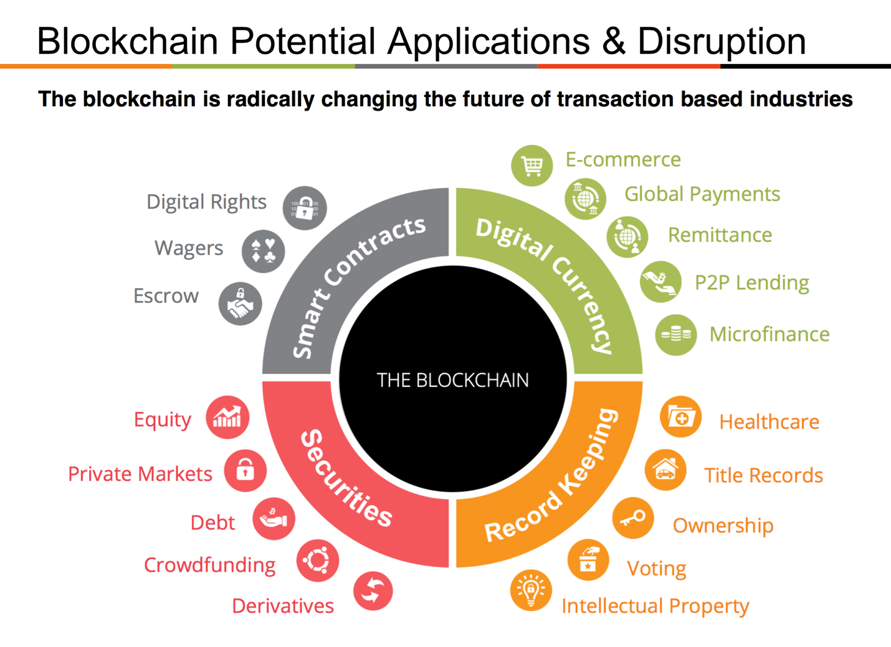

According to **World Economic Forum Report**, at least 40 central banks around the world are currently, or soon will be, researching and experimenting with central bank digital currency (CBDC). A quick glance at ten use cases for the Centeral Banks with Distributed Ledger Technology:

* *Retail central bank digital currency (CBDC) – Central bank-issued digital currency that is operated and settled in a peer-to-peer and decentralized manner (no intermediary), widely available for consumer use. Serves as a complement or substitute for physical cash and alternative to traditional bank deposits.* 
  
* *Wholesale central bank digital currency (CBDC) – Central bank-issued digital currency that is operated and settled in a peer-to-peer and decentralized manner (no intermediary), available only for commercial banks and clearing houses for use in the wholesale interbank market.*
* *Interbank securities settlement – A focused application of blockchain-based digital currency, including CBDC, enabling the rapid interbank clearing and settlement of securities for cash. Can achieve “delivery versus payment” interbank systems where two parties trading an asset, such as a security for cash, can conduct the payment for and delivery of the asset simultaneously.*
* *Payment system resiliency and contingency – The use of DLT in a primary or back-up domestic interbank payment and settlement system to provide safety and continuity from threats, including technical or network failure, natural disaster, cybercrime, and other threats. Often, this use case is coupled with others as part of the set of benefits that a DLT implementation could potentially offer.*
* *Bond issuance and lifecycle management – The use of DLT in the bond auction, issuance, or other lifecycle processes to reduce costs and increase efficiency. May be applied to bonds issued and managed by sovereign states, international organizations or government agencies. Central banks or government regulators could be “observer nodes” to monitor activity where relevant.*
* *Know-your-customer and anti-money-laundering – Digital KYC/AML processes that leverage DLT to track and share relevant customer payment and identity information to streamline processes. May connect to a digital national identity platform or plug into pre-existing e-KYC or AML systems. Could potentially interact with CBDC as part of payments and financial activity tracking.*
* *Information exchange and data sharing – The use of distributed or decentralized databases to create alternative systems for information and data sharing between or within related government or private sector institutions.*
* *Trade finance – The employment of a decentralized database and functionality to enable faster, more efficient and more inclusive trade financing. Improves on today’s trade finance processes which are often paper-based,labour-intensive and time-intensive. Customer information and transaction histories are shared between participants in the decentralized database while maintaining privacy and confidentiality where needed.*
* *Cash money supply chain – The use of DLT for issuing, tracking and managing the delivery and movement of cash from production facilities to the central bank and commercial bank branches; could include the ordering, depositing or movement of funds, and could simplify regulatory reporting.*
* *Customer SEPA Creditor Identifier (SCI) provisioning – Blockchain-based decentralized sharing repository
for SEPA credit identifiers managed by the central bank and commercial banks in the SEPA debiting scheme. Faster, streamlined and decentralized system for identity provisioning and sharing. Can replace preexisting manual and centralized processes that are time and resource-intensive. Seen in Bank of France’s Project MADRE implementation.*

----

# **Part I. Cryptocurrency Investment Performance Analysis**

This section will conduct quantative analysis to check which treadable asset outperfomed the market, based on historical financial data pulled from google & yahoo finance for:
1. 5 years interval from Aug. 1, 2015 to Aug. 1, 2020.
2. Bitcoin (BTC) closing price & volume.
3. Etherum (ETH) closing price & volume.
4. Ripple (XRP) closing price & volume.
5. SPDR Gold Trust ETF (GLD) closing price & volume.
6. S&P 500 closing price & volume.

We select the top 3 performance in crypto-market to compare it with the most popluar Gold Exchange Traded Fund (ETF) which is SPDR Gold Trust ETF (GLD), because Gold ETFs offer some of the same defensive-asset-class traits as bonds, and many investors use them to hedge against economic and political disruptions, as well as currency debasement, and it has a negative correlation with dollar.

And to have a solid conculsion, we will also use S&P 500 market index beacuse many consider it to be one of the best representations of the U.S stock market, and it has positive correlation coefficient with the dollar around 0.38 as of 2011.

Taking into account the massive effect COVID-19 had on market globally, we want to check which asset recovered from this negative impact.

   

## *Are cryptocurrencies performing and growing in popularity in comparison with the traditional equities market?*
To answer this question, we will perform our anaylsis based on 4 metrics: Risk, Return, future prejection & Trading Volume.

## 1. DAILY & CUMULATIVE RETURNS:
First, let's take a look at the daily returns of S&P 500, Gold, and the Cryptocurrencies. 

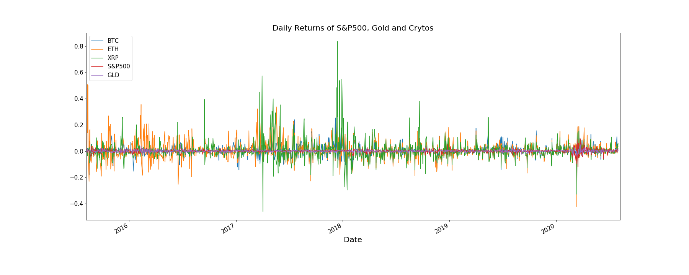

As we can see, the daily returns for Ripple and Ethereum are far more extreme compared to the others. For example, in 2018, Ripple went up by more than 80% daily while S&P500 and Gold are well capped by 20% for the past 5 years. Now, what about the cumulative returns? 

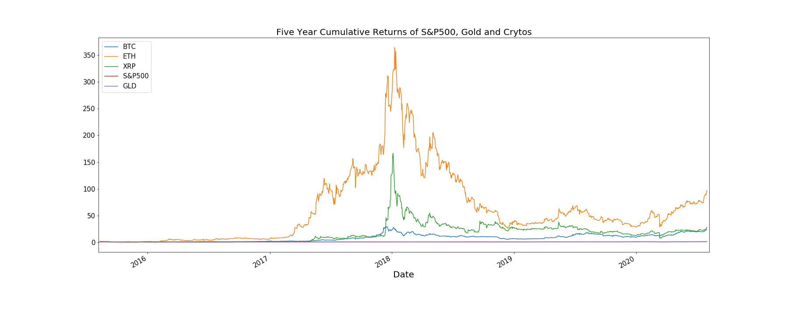

Based on the extreme volatility shown in the previous daily return graph, it is expected that the cumulative returns of Cryptos would not be a steadily upward line, but we can tell they still well outshined the performance of S&P 500 and Gold. The peak, at almost 35000% cumulative return of Ethereum from 2015 to 2018, shows the bubble when Cryptocurrency became an insane fever internationally and then rapidly plunged due to people's fear and doubt in its real intrinsic value. By contrast, market and gold returns seem almost flat because of the massive scale from Cryptos, so it will be helpful to see how much returns that actually has been generated from August 2015 to August 2020 compared to Ethereum: 

### Let's take a look at the investment returns if we start with 5000 USD, how much roughly we will end with: 

If invested in Bitcoin, I would end up after 5 years with 119,720 USD;  
If invested in Ethereum, I would end up after 5 years with 485,796 USD;  
If invested in Ripple, I would end up after 5 years with  142,216 USD;  
If invested in Gold, I would end up after 5 years with 8,860 USD;  
If invested in S&P 500, I would end up after 5 years with  7,872 USD.

### "Therefore, we better off investing in cryptos in terms of returns."

## 2. RISK & CORRELATION:
Moreover, we want to calculate the annual standard deviations and their correlations: 

| Ticker  | Annual Std |
| ------- | ---------- |
| XRP     | 1.1803     |
| ETH     | 1.0815     |
| BTC     | 0.6730     |
| S&P 500 | 0.1942     |
| GLD     | 0.1345     |

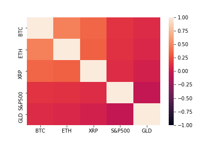

As we can see, Cryptos are about 5 times more volatile than market. S&P 500 & gold has a negative correlation indicating they tend to move in opposite directions. Cryptos are more correlated to each other than to S&P 500 and Gold. Take BTC as an example, it's 14% correlated to S&P 500 and 10% correlated to Gold, indicating that it performs more similarly to traditional riskier assets even though it is designed to a be a medium of exchange currency. 

## 3. SHARPE RATIO:
It will be worth looking at Sharpe ratios as well. 

According to the bar chart, Ethereum offers the best risk-adjusted returns among assets of other Cryptos, Gold and S&P 500, assuming zero risk-free interest rate. 

## 4. MONTE CARLO SIMUATION:
It would be very interesting to know how future returns look like for Cryptos, so we ran a Monte Carlo Simulation on two portfolios (100 simulations over the next 5 years): One consists of 80% S&P and 20% Gold, and the other consists equally weighted Bitcoin, Ethereum and Ripple: 

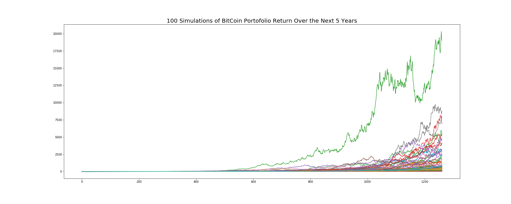

Again, these different level of multipliers in portfolio returns, i.e. 200% and 200,000% in 5 years, suggest that Cryptos offer a way better return than a traditional portfolio. 

 

## 5. TRADING VOLUME:

Aside from Risk and Return, we also wondered how the trading volume evolved historically.

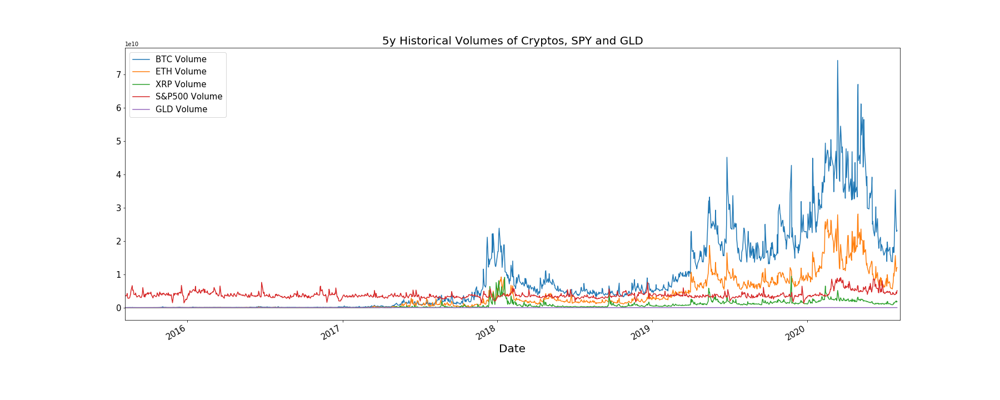

Trading volume of BTC is about 6 times higher than SPY during peak period which is about 70 billion and this dwarfs SPY and GLD. However, it is worth noticing that trading volume of Cryptos were very low before mid 2017 and then surpassed the other traditional assets at a fast pace. Let's take a closer look at trading volumes 5 years ago and then after.

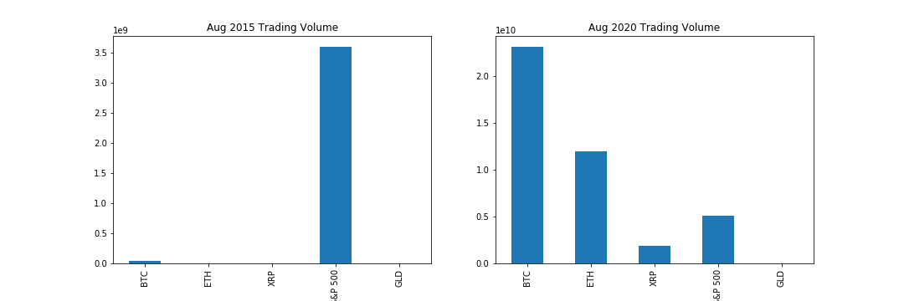

We can see a clear contrast between 5 years ago and now that there is a lot more investors in trading Cryptos due to the lucrative profit. 

---

# **Part II. Stablecoin Stability Analysis**

In this part, we took a look at how Bitcoin is growing and how the largest stablecoin by market cap, Tether, compares in volatility to the USD. 

### With our findings from Part I, we now know that Bitcoin is a popular investment and made people a lot of money...But is its usage growing as well?

For this section, we grabbed the past 5 years of historical data on two very important yet basic Bitcoin metrics: The number of Bitcoin addresses active on a daily basis and the total number of Bitcoin transactions per day (an active address means that it has either sent or received Bitcoin that day). As you can see in the graphs below, both of these are ticking upwards relatively constantly since 2015 (despite the large pop and plunge at the beginning of 2018). All in all, it is fair to say that the largest cryptocurrency network is certainly growing with time and people are indeed using it to a certain extent to transfer value.

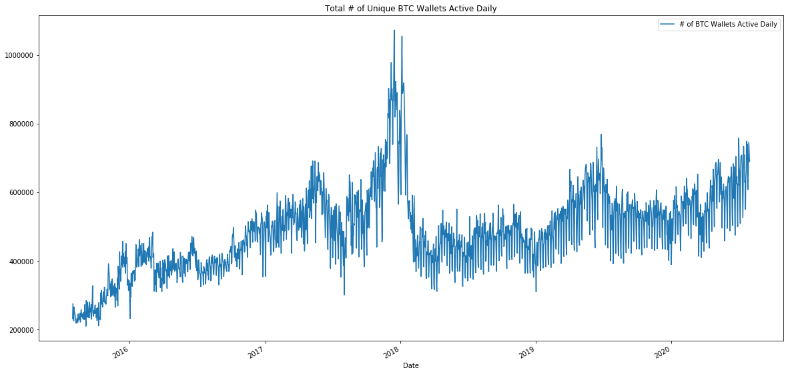

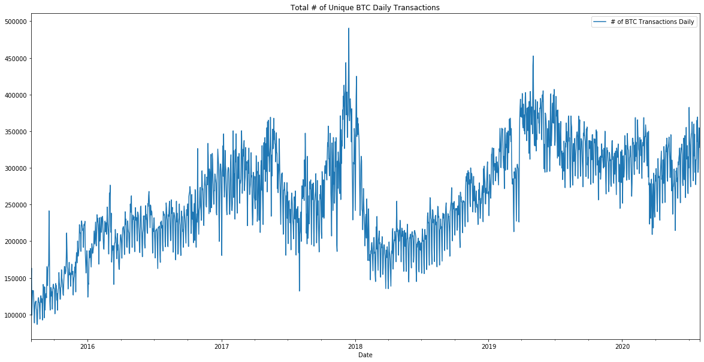

While we know that Bitcoin is far too volatile to currently be relied upon as a currency at the Macro level, we decided to take a quick look at Ripple, another cryptocurrency we looked at earlier. Ripple, which was originally created in 2012 as a "real-time, gross settlement and remittance network", was at one point in time widely considered to be the first semi-acceptable crypto to be used for instant transfers. Let's take a look how Ripple's price volatility compares to the US Dollar Index (USDX), which is a measure of the value of the USD against a weighted basket of currencies consisting of the Euro, Japanese Yen, Pound Sterling, Canadian Dollar, Swedish Krona & the Swiss Franc.

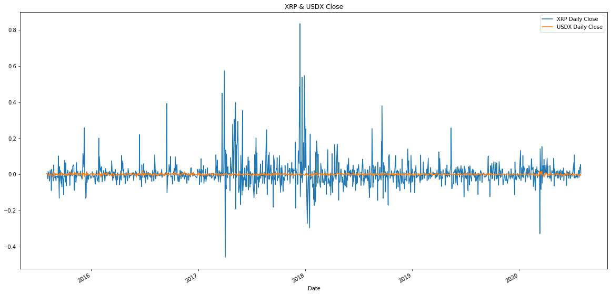

As we can see, Ripple is far more volatile than the very stable USDX. Furthermore, the correlation between the two is essentially non-existent when we took a deeper look at it in Python. Although Cryptocurrencies are not very reliable currencies because of their fluctuations in price, they have set the stage for the emergence of digital dollars known as "stablecoins".

## *Are stablecoins on the path to becoming a viable substitution as a currency that are actually utilized for payments?*

The most widely used stablecoin today is Tether (USDT) which was created in 2015. Tether's price, which is supposed to be pegged to the value of USD, has not truly stayed “pegged” to the USD at all. The idea that one USDT is the same as one USD was proven false by Forbes in March of 2019 when they discovered that the company behind Tether had moved away from holding 100% USD in their reserves to holding “cash equivalents”, which is really just a fancy term for holding a basket of other volatile cryptocurrencies in addition to USD in their reserves. Let's take a look at how Tether's price volatility looks in comparison to the USDX:

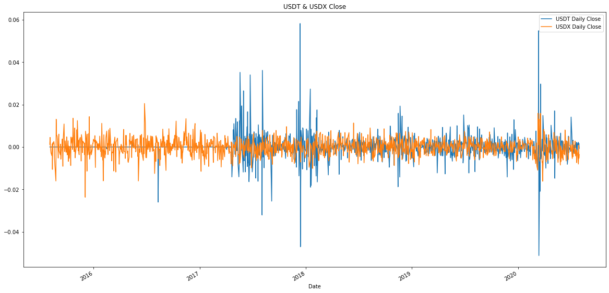

As we can see, while Tether is definitely an upgrade over Ripple when it comes to having more stable price, it is still far too volatile when compared to the world's reserve currency. At some periods in time, it is almost 3x as volatile and tt is not uncommon to see Tether's price down from $1 to roughly $.97 on certain wild days in Crypto. While the volatility is simply too great in stablecoins, others have taken note of how a digital dollar might be important as we move forward into a more online world.

Facebook, with its creation of Libra 2019, stepped into the fray to offer a digital dollar that would be available to all people with a Facebook or WhatsApp account. Simply, they would exchange their dollars for these “Zuck Bucks” and be able to transact with this new asset. Their partnership announcement with the likes of FinTech giants such as PayPal, Stripe and Coinbase quickly caught the attention of the US government. With the arrival of Facebook to crypto, foreign governments all across the globe have been forced to implement more comprehensive regulatory framework for this new emerging asset class. In the US, “The Cryptocurrency Act of 2020” was introduced by Rep. Paul Gosar of Arizona in March of this year. This is a sweeping bill that divides crypto assets into three different categories: crypto-commodity, crypto-currency and crypto-security. While there are still tons of questions regarding the bill, the fact that something this extensive made it to House floor shows that crypto clearly has a place in America’s future.

Just this past week, quite possibly the most important development in the US becoming more open to adopting a version of a digital dollar took place when the Federal Reserve Bank of Boston announced that they had partnered with MIT to research and better understand the ways in which a digital dollar could be an advantage to the US. The Fed Governor, Lael Brainard, stated that the bank will work with MIT researchers on a multiyear project to develop and test the use cases of a “hypothetical” central bank digital currency.

## *How would stablecoins play a role in our lives today?*

In conclusion, through our data analysis and extensive research on the topic, we do believe that a digital stablecoin could be a useful tool for the US government to adopt moving forward. Look no further than the COVID-19 pandemic, which necessitated the US to deploy stimulus checks, SBA loans and other disaster-related credit packages to help slow the impact this virus would have on our economy. The average stimulus check has taken over 6 weeks to reach certain people and some have still not received their checks to date! Had we had the rails in place to more efficiently delegate funds out to those who need them most urgently in a timely manner, we believe that we could have mitigated some of this disaster on the economic front caused by COVID-19. The way of the world is only moving more digital and in order to keep up with the times, it is important for our government, and all governments across the globe, to continue looking into these digital alternatives.

---
## REFERENCES:
1. [Cointelegraph](https://cointelegraph.com/news/bostons-federal-reserve-bank-and-mit-to-tackle-digital-currency-research)
2. [Coindesk](https://www.coindesk.com/the-federal-reserve-is-experimenting-with-a-digital-dolla)
3. [The Verge](https://www.theverge.com/2020/3/3/21163658/facebook-libra-cryptocurrency-token-ditching-plans-calibra-wallet-delay)
4. [Forbes](https://www.forbes.com/sites/francescoppola/2019/03/14/tethers-u-s-dollar-peg-is-no-longer-credible/#2f011dae451b)
5. [Coindesk](https://www.coindesk.com/the-cryptocurrency-act-of-2020-is-dead-on-arrival-washington-dc-tells-sponsors)
6. [World Economic Forum Report](http://www3.weforum.org/docs/WEF_Central_Bank_Activity_in_Blockchain_DLT.pdf)
