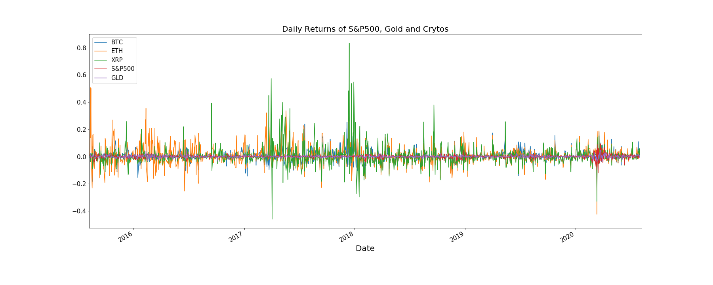
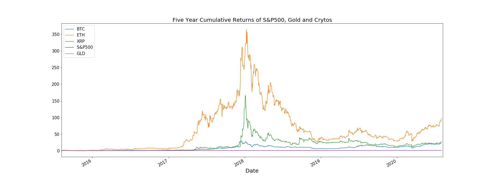
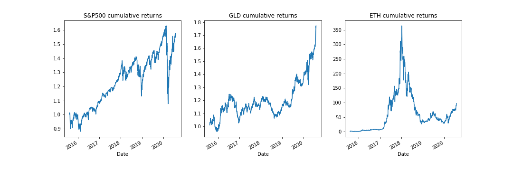
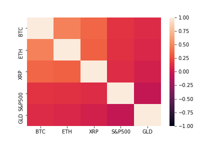
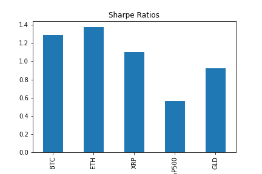
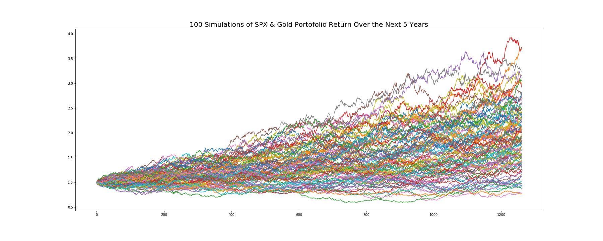
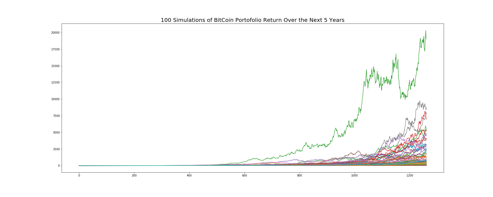
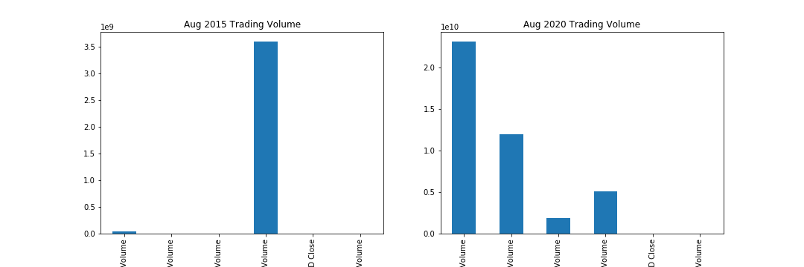

# Team 4 Group Project: Cryptocurrency Growth Against Other Assets in Today's Macroeconomic Environment

## Part I. Cryptocurrency Investment Performance Analysis

In this part, we want to analyze cryptocurrency as an investment option and we would like to answer the following question:

### Are cryptocurrencies performing and growing in popularity in comparison to the traditional equities market?

We will use past 5-year historical market data of S&P 500 index and Gold ETF(GLD) against our cryptocurrency portfolio that consists of the top 3 digital currencies: Bitcoin(BTC), Ethereum(ETH) and Ripple(XRP). We are going to compare their Risk, Return and Trading Volume.

*Input data from Google Finance in Data directory*

First, let's take a look at the daily returns of S&P 500, Gold, and the Cryptocurrencies. 

As we can see, daily returns of Ripple and Ethereum are more extreme compared to others. For example in 2018, Ripple went up by more than 80% daily while S&P500 and Gold are well capped by 20% for the past 5 years. Now, what about the cumulative returns? 

Based on the extreme volatility shown in the previous daily return graph, it is expected that the cumulative returns of crytos would not be a steadily upward line, but we can tell they still well outshined the performance of S&P 500 and Gold. The peak at almost 35000% cumulative return of Ethereum from 2015 to 2018 shows the bubble when Crytocurrency became an insane fever internationally and then rapidly plunged due to people's fear and doubt in its real intrinsic value. By contrast, market and gold returns seem almost flat because of the massive scale from Cryptos, so it will be helpful to see how much returns that actually has been generated from August 2015 to August 2020 compared to Ethereum: 

Let's the numbers in dollar terms and the investment returns if we start with 5000 USD: 

If invested in Bitcoin, I would end up after 5 years with 119,720 USD;
If invested in Etherum, I would end up after 5 years with 485,796 USD;
If invested in Ripple, I would end up after 5 years with  142,216 USD; 
If invested in Gold, I would end up after 5 years with 8,860 USD; 
If invested in S&P 500, I would end up after 5 years with  7,872 USD.

Therefore, we better off investing in cryptos in terms of returns. Moreover, We want to calculate the annual standard deviations and their correlations: 

XRP       1.180363 \
ETH       1.081535 \
BTC       0.673042 \
S&P500    0.194288 \
GLD       0.134523 \

As we can see, Cryptos are about 5 times more volatile than market. S&P 500 & gold has a negative correlation indicating they tend to move in opposite directions. Cryptos are more correlated to each other than to S&P 500 and Gold. Take BTC as an example, it's 14% correlated to S&P 500 and 10% correlated to Gold, indicating that it performs more simlarly to a traditional risky asset even though it is designed to a be a medium of exchange currency. 

It will be worth looking at sharpe ratios as well. 

According to the bar chart, Etherum offers the best risk-adjusted returns among assets of other Cryptos, Gold and S&P 500, assuming zero risk-free interest rate. 

It would be very interesting to know how future return looks like for Crytos, so we did Monte Carlo Simulation on two portfolios(100 simulations over the next 5 years): One consists of 80% S&P and 20% Gold, and the other consists equally weighted Bitcoin, Ethereum and Ripple: 

Again these different level of multipliers in portofolio returns, i.e. 200% and 200,000% in 5 years, suggest that Crytops offer a way better return than a tradional portfolio. 

Aside from Risk and Return, we also wonder how the trading volume evolve historically. 

Trading volume of BTC is about 6 times higher than SPY during peak period which is about 70 billion and dwarf SPY and GLD. However, it is worth noticing that trading volume of Cryptos were very low before mid 2017 and then surpassed the other traditional assets in a fast speed. Let's take a closer look at trading volumes 5 years ago and after.

We can see a clear contrast between 5 years ago and now that there is a lot more investors in trading Crytos due to the lucrative profit. 

